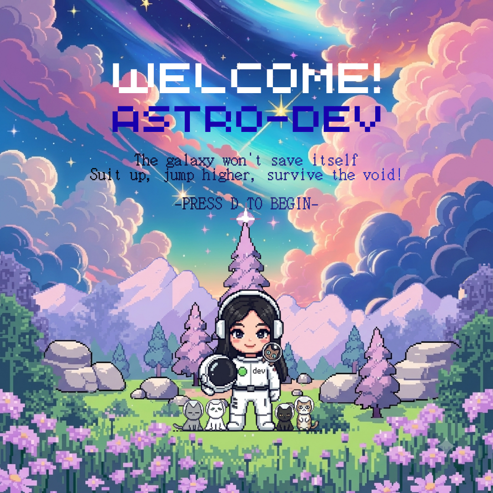
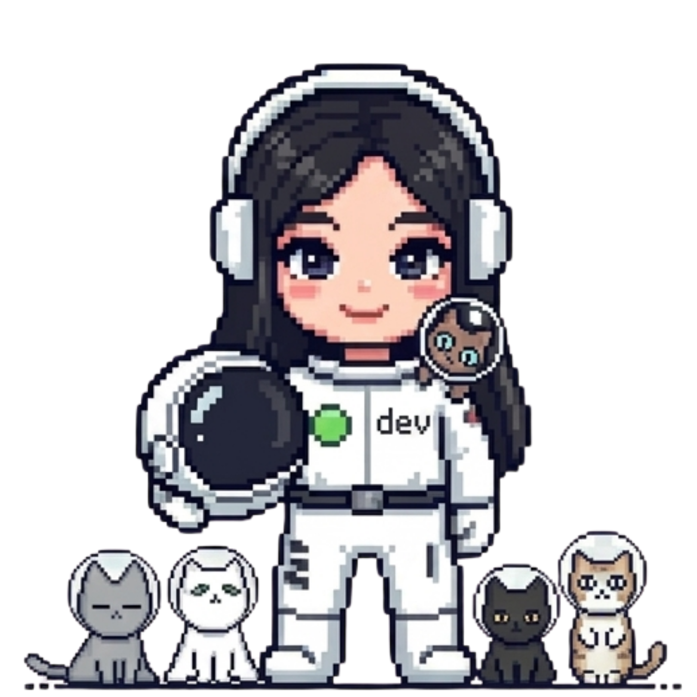
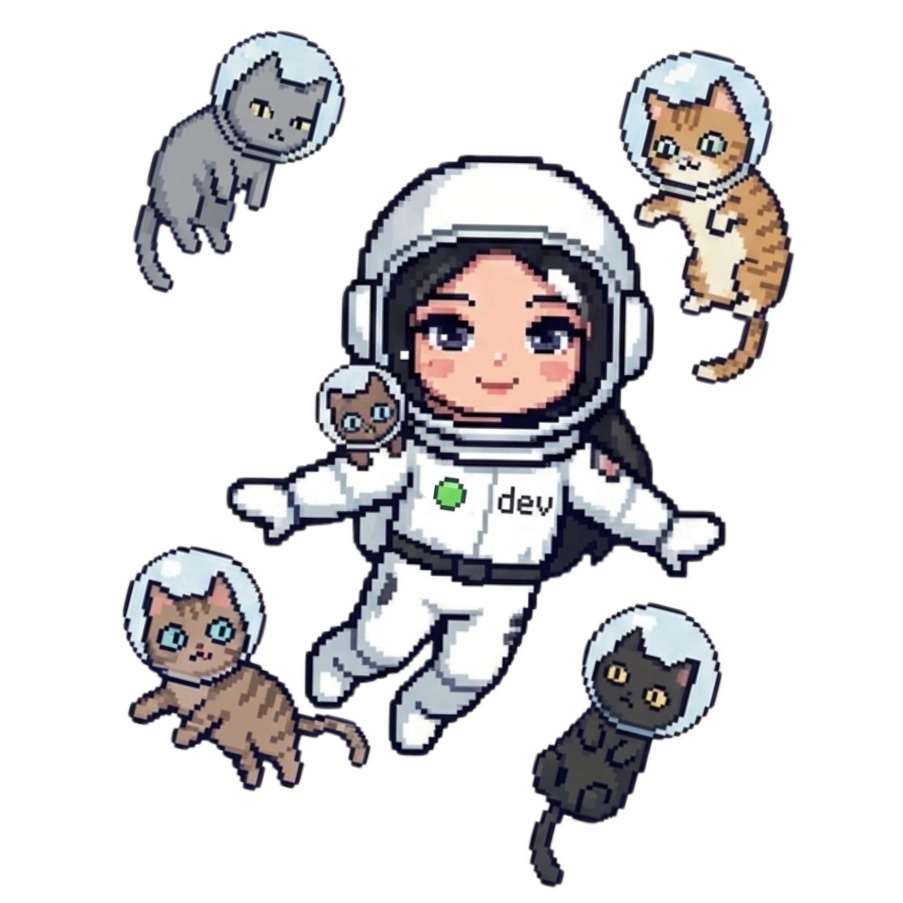
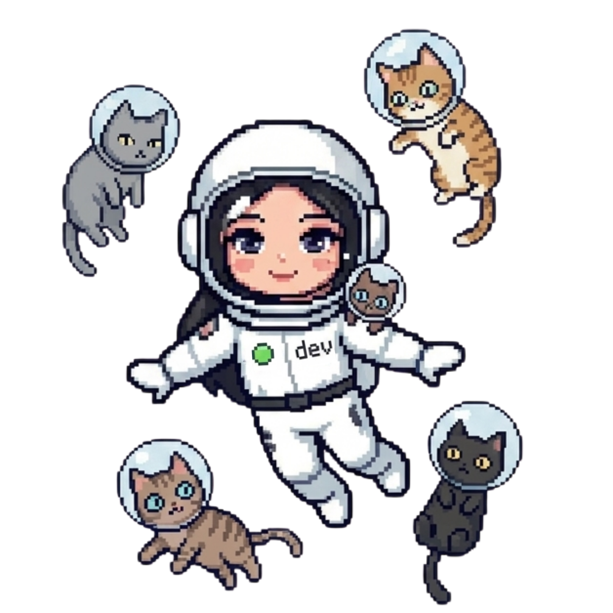
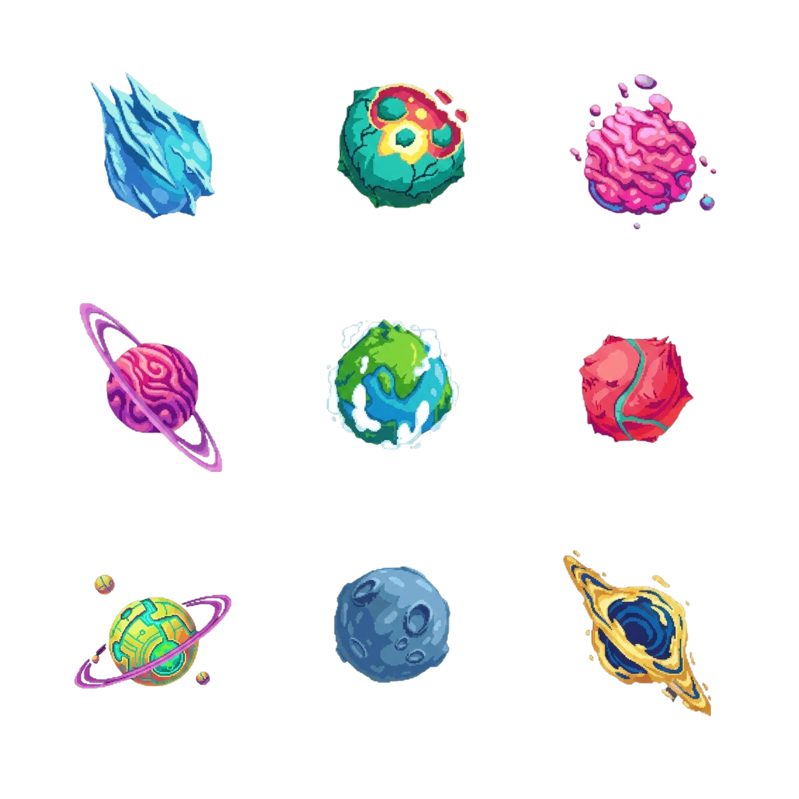
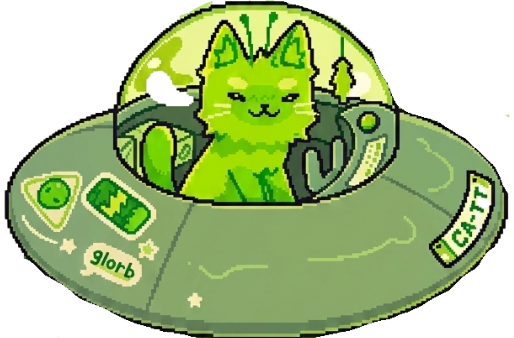
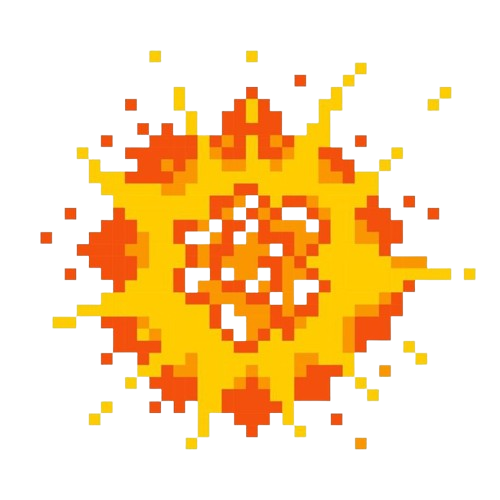

# Astro-Dev Game

**Laporan Teknis dan Pedoman Penggunaan**

| Identitas | Keterangan |
|---|---|
| **Nama** | Devi Putri Sekar Arum |
| **NRP** | 5024241049 |
| **Kelas** | Semester Genap 2025/2026 |
| **Mata Kuliah** | Pengolahan Citra dan Video |

---

## Daftar Isi
 
1. [Deskripsi Game](#1-deskripsi-game)
2. [Latar Belakang dan Motivasi](#2-latar-belakang-dan-motivasi)
3. [Fitur Game](#3-fitur-game)
4. [Tools yang Digunakan](#4-tools-yang-digunakan)
5. [Arsitektur dan Struktur Kode](#5-arsitektur-dan-struktur-kode)
6. [Perbandingan game.py vs main.py: Manual vs Built-in Morphology](#6-perbandingan-gamepy-vs-mainpy-manual-vs-built-in-morphology)
7. [Alur Program](#7-alur-program)
8. [Implementasi Teknis Mendetail](#8-implementasi-teknis-mendetail)
9. [Analisis Kinerja dan Perbandingan](#9-analisis-kinerja-dan-perbandingan)
10. [Cara Menjalankan](#10-cara-menjalankan)
11. [Dokumentasi Aset](#11-dokumentasi-aset)
12. [Demo Video](#12-demo-video)
13. [Struktur Direktori](#13-struktur-direktori)
14. [Kesimpulan](#14-kesimpulan)

---

## 1. Deskripsi Game

**Astro-Dev** adalah game aksi berbasis Python yang dikendalikan sepenuhnya melalui gestur tangan menggunakan webcam, tanpa keyboard maupun mouse sebagai input permainan. Pemain berperan sebagai AstroDev, seorang astronot perempuan yang menjaga planetnya bersama **5 kucing penjaga berbaju antariksa** dari serangan dua ancaman: planet-planet asing yang berjatuhan dari luar angkasa, dan alien kucing hijau bernama *Glorb* yang mengendarai piring terbang. Setiap objek yang lolos menyentuh tanah akan mengurangi satu nyawa dari total 5 nyawa yang diwakili oleh indikator lingkaran merah di sudut kiri atas layar.
 
Kontrol game sepenuhnya bergantung pada teknik **HSV-based skin color segmentation** dan **Convexity Defects finger counting** yang diimplementasikan menggunakan OpenCV. Tangan kiri mengontrol arah gerak horizontal karakter, sementara tangan kanan mengontrol ketinggian lompatan. Tidak ada library deteksi pose seperti MediaPipe yang digunakan; semua pipeline deteksi tangan dibangun dari primitif OpenCV dan NumPy murni.
 
Proyek ini terdiri dari **dua versi implementasi** yang dapat dibandingkan secara langsung:
 
- **`game.py`** — Versi utama dengan morfologi **manual** menggunakan Python loop dan operasi NumPy dari nol, tanpa memanggil fungsi morfologi bawaan OpenCV sama sekali.
- **`main.py`** — Versi alternatif dengan morfologi menggunakan fungsi **built-in** OpenCV (`cv2.erode()` dan `cv2.dilate()`), sehingga keduanya dapat dibandingkan dari sisi hasil deteksi, kecepatan eksekusi, dan kualitas mask yang dihasilkan.

---

## 2. Latar Belakang dan Motivasi
 
Proyek Astro-Dev lahir dari semangat untuk mengeksplorasi pengolahan citra secara mendalam tanpa bergantung pada solusi siap pakai. Dalam era di mana library seperti MediaPipe dapat mendeteksi pose tangan hanya dengan tiga baris kode, proyek ini sengaja mengambil jalur yang lebih panjang dengan membangun setiap tahap pipeline dari awal.
 
Pemilihan tema game berbasis luar angkasa juga bukan kebetulan semata. Di balik estetika astronot dan planet-planet jatuh terdapat pesan yang lebih dalam: kita semua adalah penjaga bumi, dan seperti AstroDev yang berjuang mempertahankan planetnya dari ancaman luar, kita pun memiliki tanggung jawab yang sama terhadap satu-satunya rumah yang kita miliki di alam semesta ini.
 
Dari sisi teknis, proyek ini menjawab pertanyaan mendasar dalam mata kuliah Pengolahan Citra dan Video: bagaimana cara sistem komputer "melihat" dan "memahami" gestur tangan manusia? Jawabannya dijabarkan secara eksplisit melalui kode dari piksel mentah kamera hingga tindakan karakter di layar game, setiap langkah transformasi citra dapat ditelusuri dan dipelajari.

---

## 3. Fitur Game

**a. Kontrol berbasis gestur tangan real-time**

Deteksi dilakukan pada setiap frame kamera (~30 fps) tanpa buffering atau delay tambahan. Karakter merespons perubahan jumlah jari yang ditampilkan secara langsung.

**b. Dua jenis musuh dengan perilaku berbeda**

Planet jatuh secara vertikal lurus dengan kecepatan acak antara 2 sampai 5 piksel per frame, sehingga jalur lintasannya dapat diprediksi dan pemain dapat merencanakan lompatan. Sebaliknya, alien Glorb bergerak secara sinusoidal pada sumbu horizontal sambil turun, menciptakan pola zigzag yang tidak dapat diprediksi secara linier dan membutuhkan penyesuaian posisi yang dinamis dari pemain.


**c. Sistem lompatan bertingkat tiga level**

Ketinggian lompatan ditentukan oleh jumlah jari yang ditampilkan tangan kanan. Satu jari menghasilkan lompatan dengan kecepatan awal vertikal -22 piksel/frame, dua jari -44 piksel/frame, dan tiga jari -66 piksel/frame. Gravitasi konstan 2 piksel/frame^2 diterapkan setiap frame.

**d. Sistem skor berbasis nilai objek**

Planet bernilai 1 poin dan alien bernilai 2 poin. Teks skor mengambang (+1 atau +2) muncul di posisi objek yang dihancurkan lalu memudar secara bertahap dalam 30 frame menggunakan teknik alpha blending dengan `cv2.addWeighted()`.

**e. Tampilan debug tiga panel simultan**

Jendela game menampilkan frame permainan (800×800 piksel), feed kamera langsung (640×240 piksel), dan visualisasi mask HSV (640×240 piksel) secara bersamaan dalam satu jendela OpenCV berukuran 1440×800 piksel. Panel debug ini sangat berguna untuk memahami cara kerja deteksi tangan secara real-time dan melakukan kalibrasi threshold warna kulit.

**f. Morfologi manual tanpa cv2.morphologyEx**

Fungsi erode dan dilate diimplementasikan dari nol menggunakan Python loop dan operasi array NumPy, bukan memanggil fungsi morfologi bawaan OpenCV. Fitur utama yang membedakan proyek ini dari implementasi game serupa adalah ketersediaan dua file kode yang mengimplementasikan morfologi mask dengan pendekatan berbeda, memungkinkan perbandingan langsung antara pendekatan manual dan built-in.

---

## 4. Tools yang Digunakan

| Komponen | Versi | Peran dalam Proyek |
|---|---|---|
| Python | 3.13 | Runtime utama |
| opencv-python | 4.13.0.92 | Akuisisi kamera, konversi ruang warna, deteksi kontur, rendering teks dan bentuk geometri, penampilanframe |
| numpy | 2.4.6 | Representasi array gambar, operasi mask HSV berbasis boolean, kalkulasi vektor untuk penghitungan jari, padding morfologi manual |
| math (stdlib) | bawaan | Fungsi `sin()` untuk gerak sinusoidal alien, `pi` untuk inisialisasi offset drift acak |
| random (stdlib) | bawaan | Randomisasi posisi spawn, kecepatan objek, interval spawn, dan indeks planet dari spritesheet |
| winsound (stdlib) | bawaan Windows | Pemutaran efek suara `.wav` secara asinkron saat game dimulai (hanya Windows) |

**Alasan tidak menggunakan MediaPipe atau library deteksi pose lain:**
Proyek ini sengaja membangun pipeline deteksi tangan dari primitif pengolahan citra sebagai implementasi kompetensi mata kuliah Pengolahan Citra dan Video. Seluruh proses dari segmentasi warna, morfologi, pencarian kontur, hingga analisis geometri convex hull dilakukan secara eksplisit.

---

## 5. Arsitektur dan Struktur Kode
 
Kedua file (`game.py` dan `main.py`) berbagi arsitektur modular yang sama dengan pemisahan tanggung jawab yang jelas:
 
**Lapisan Utilitas** berisi fungsi-fungsi pembantu yang berdiri sendiri dan tidak bergantung pada state game: `load_sprite()` untuk memuat aset gambar dengan penanganan channel alpha otomatis, `slice_planet_spritesheet()` untuk memotong grid spritesheet menjadi list sprite individual, `overlay_sprite()` untuk alpha compositing Porter-Duff, `manual_erode()` dan `manual_dilate()` (hanya di `game.py`) untuk morfologi manual, `get_hand_mask()` sebagai pipeline deteksi utama, `get_largest_contour_in_region()` untuk isolasi kontur tangan per zona, `count_fingers()` untuk estimasi jumlah jari via convexity defects, dan `check_collision()` untuk AABB collision detection.
 
**Lapisan Objek Game** berisi kelas-kelas yang merepresentasikan entitas game: `Planet` dengan perilaku jatuh lurus dan transisi ke animasi ledakan, `Alien` dengan perilaku jatuh sinusoidal dan transisi ledakan, serta `FloatingText` untuk teks skor animasi yang memudar.
 
**Lapisan State Game** terdiri dari kelas `GameState` yang merupakan jantung logika game. Kelas ini menyimpan seluruh state permainan (posisi karakter, daftar objek aktif, skor, nyawa) dan mengekspos dua metode utama: `update()` yang menerima input jari dan memajukan simulasi satu frame, serta `draw()` yang me-render state saat ini ke array gambar 800×800 piksel.
 
**Lapisan Tampilan** berisi fungsi `build_combined_display()` yang menggabungkan tiga panel (game frame, camera view, mask visualization) menjadi satu canvas tunggal untuk ditampilkan.
 
**Lapisan Utama** adalah fungsi `main()` yang mengatur inisialisasi aset, loop kamera, integrasi antara pipeline deteksi tangan dan logika game, serta penanganan input keyboard.

---

## 6. Perbandingan game.py vs main.py: Manual vs Built-in Morphology
 
Ini adalah perbedaan inti dan paling fundamental antara kedua file. Seluruh kode game, logika fisika, rendering, dan deteksi kontur identik di antara keduanya. Satu-satunya perbedaan terletak pada implementasi fungsi morfologi di dalam `get_hand_mask()`.
 
### 6.1 Implementasi di game.py — Morfologi Manual
 
Di `game.py`, fungsi `manual_erode()` dan `manual_dilate()` diimplementasikan dari nol menggunakan Python loop dan operasi array NumPy tanpa memanggil satu pun fungsi morfologi bawaan OpenCV.
 
```python
# Erosi manual — game.py (baris 68–77)
def manual_erode(binary_img, kernel_size=5):
    pad = kernel_size // 2
    padded = np.pad(binary_img, pad, mode='constant', constant_values=0)
    output = np.zeros_like(binary_img)
    for y in range(binary_img.shape[0]):
        for x in range(binary_img.shape[1]):
            roi = padded[y:y+kernel_size, x:x+kernel_size]
            if np.all(roi == 255):   # Piksel dipertahankan hanya jika seluruh kernel putih
                output[y, x] = 255
    return output
 
# Dilasi manual — game.py (baris 79–88)
def manual_dilate(binary_img, kernel_size=5):
    pad = kernel_size // 2
    padded = np.pad(binary_img, pad, mode='constant', constant_values=0)
    output = np.zeros_like(binary_img)
    for y in range(binary_img.shape[0]):
        for x in range(binary_img.shape[1]):
            roi = padded[y:y+kernel_size, x:x+kernel_size]
            if np.any(roi == 255):   # Piksel diset putih jika ada satu piksel putih di kernel
                output[y, x] = 255
    return output
```
 
Dan urutan aplikasinya di `get_hand_mask()`:
 
```python
# Urutan morfologi di game.py (baris 109–112)
m_processed = manual_dilate(combined_mask, kernel_size=5)   # Langkah 1: Dilasi
m_processed = manual_erode(m_processed, kernel_size=5)      # Langkah 2: Erosi → Closing selesai
m_processed = manual_erode(m_processed, kernel_size=5)      # Langkah 3: Erosi lagi
final_mask  = manual_dilate(m_processed, kernel_size=5)     # Langkah 4: Dilasi → Opening selesai
```
 
Selain itu, `game.py` juga menambahkan **preprocessing Gaussian Blur** sebelum konversi HSV:
 
```python
# Preprocessing tambahan di game.py (baris 102)
roi_blur = cv2.GaussianBlur(roi, (5, 5), 0)
hsv = cv2.cvtColor(roi_blur, cv2.COLOR_BGR2HSV)  # Blur dulu, baru konversi
```
 
### 6.2 Implementasi di main.py — Morfologi Built-in OpenCV
 
Di `main.py`, morfologi dilakukan langsung menggunakan fungsi C++ yang telah dioptimasi di dalam OpenCV. Tidak ada Python loop sama sekali; operasi berjalan di level native code.
 
```python
# Morfologi built-in di main.py (baris 83–88)
kernel  = np.ones((5, 5), dtype=np.uint8)
eroded  = cv2.erode(mask,    kernel, iterations=2)   # Erosi 2x
opened  = cv2.dilate(eroded,  kernel, iterations=2)  # Dilasi 2x → Opening selesai
dilated = cv2.dilate(opened,  kernel, iterations=3)  # Dilasi 3x
closed  = cv2.erode(dilated,  kernel, iterations=1)  # Erosi 1x → Closing selesai
```
 
Perbedaan lain yang juga patut dicatat: `main.py` **tidak** menggunakan Gaussian Blur sebelum konversi HSV, konversi dilakukan langsung pada frame ROI mentah:
 
```python
# Tanpa preprocessing blur di main.py (baris 80–81)
roi  = frame[roi_y:, :]
hsv  = cv2.cvtColor(roi, cv2.COLOR_BGR2HSV)  # Langsung konversi tanpa blur
```
 
### 6.3 Tabel Perbandingan Komprehensif
 
| Aspek | game.py (Manual) | main.py (Built-in) |
|---|---|---|
| **Implementasi erode** | Python nested loop + `np.all(roi == 255)` | `cv2.erode(mask, kernel, iterations=N)` |
| **Implementasi dilate** | Python nested loop + `np.any(roi == 255)` | `cv2.dilate(mask, kernel, iterations=N)` |
| **Bahasa eksekusi** | Python bytecode + NumPy C | C++ native (SIMD/NEON optimized) |
| **Preprocessing sebelum HSV** | GaussianBlur 5×5 aktif | Tidak ada blur (langsung konversi) |
| **Urutan operasi morfologi** | Dilate→Erode (Close) lalu Erode→Dilate (Open) | Erode×2→Dilate×2 (Open) lalu Dilate×3→Erode×1 (Close) |
| **Total operasi morfologi** | 4 pass (1D+1E+1E+1D) | 8 pass (2E+2D+3D+1E) |
| **Kecepatan estimasi (640×480)** | ~2–8 detik per frame (bergantung CPU) | <5 ms per frame |
| **Tujuan penggunaan** | Pembelajaran dan demonstrasi algoritma | Performa real-time |
| **Kualitas mask** | Lebih halus karena ada preprocessing blur | Sedikit lebih "kasar" di tepi tapi lebih cepat |
 
---

## 7. Alur Program
 
```
INISIALISASI
  Muat semua aset (gambar, background, spritesheet)
  Buka kamera (cv2.VideoCapture(0))
  Buat objek GameState
  Tampilkan layar welcome
 
LOOP UTAMA (per frame)
  |
  +-- Baca frame kamera
  |     cap.read() -> ret, frame
  |
  +-- PRE-PROCESSING FRAME
  |     flip horizontal (mirroring agar tidak terbalik)
  |     resize ke 640×480
  |
  +-- PIPELINE DETEKSI TANGAN [get_hand_mask()]
  |     - Potong ROI: 35% bawah frame (y ≥ 168px dari atas pada frame 480px)
  |     - [game.py] GaussianBlur 5×5 pada ROI
  |     - BGR → HSV
  |     - Buat mask1: H∈[0,20], S∈[30,255], V∈[60,255]  (kulit normal)
  |     - Buat mask2: H∈[160,179], S∈[30,255], V∈[60,255] (kulit merah-tua)
  |     - combined = mask1 OR mask2
  |     - [game.py]  dilate(5) → erode(5) → erode(5) → dilate(5)  [MANUAL]
  |     - [main.py]  erode×2 → dilate×2 → dilate×3 → erode×1      [BUILT-IN]
  |     - Kembalikan full_mask dan roi_y
  |
  +-- SEGMENTASI ZONA
  |     Zona kiri  : x ∈ [0, 320)
  |     Zona kanan : x ∈ [320, 640)
  |     get_largest_contour_in_region() untuk masing-masing zona
  |
  +-- PENGHITUNGAN JARI [count_fingers()]
  |     - Konveks hull (returnPoints=False → kembalikan indeks)
  |     - convexityDefects
  |     - Filter defect: sudut < 90° DAN kedalaman > 10000
  |     - return min(jumlah_defect + 1, 5)
  |
  +-- UPDATE LOGIKA GAME [GameState.update()]
  |     - Gerak horizontal karakter berdasarkan left_fingers
  |     - Fisika lompatan (vy += GRAVITY setiap frame)
  |     - Trigger lompatan berdasarkan right_fingers
  |     - Spawn planet dan alien berdasarkan timer
  |     - Update posisi semua objek aktif
  |     - check_collisions(): cek injakan dan lolosnya objek ke lantai
  |     - Hapus objek yang dead dari list
  |
  +-- RENDER [GameState.draw() + build_combined_display()]
  |     - Gambar background.copy()
  |     - Overlay semua planet dan alien (atau efek ledakan)
  |     - Overlay sprite karakter (stay/left/right)
  |     - Render teks skor melayang
  |     - Render HUD (lingkaran nyawa, skor)
  |     - Anotasi cam_view: garis zona, bounding box tangan, label jari
  |     - Konversi mask ke BGR untuk visualisasi
  |     - Gabungkan 3 panel: game (800×800) + kamera (640×240) + mask (640×240)
  |     - cv2.imshow()
  |
  +-- INPUT KEYBOARD
        'q' → keluar
        'd' → mulai game dari welcome
        'r' → restart (saat game over)
```
 
---
 
## 8. Implementasi Teknis Mendetail
 
### 8.1 Deteksi Warna Kulit (HSV Skin Segmentation)
 
Fungsi `get_hand_mask()` adalah pintu masuk seluruh pipeline deteksi gestur. Prinsip dasarnya adalah bahwa warna kulit manusia, meskipun bervariasi antara individu, menempati rentang yang relatif terbatas di ruang warna HSV (Hue-Saturation-Value). Ruang warna ini dipilih daripada BGR atau RGB karena komponen Hue memisahkan informasi "jenis warna" dari intensitas cahaya. Akibatnya, kulit yang diterangi lampu terang dan kulit dalam bayangan memiliki nilai Hue yang serupa, meskipun nilai Brightness (V) berbeda jauh.
 
**Region of Interest (ROI):** Deteksi hanya dilakukan pada 65% bawah frame kamera, dimulai dari `roi_y = int(frame_height * 0.35)`. Pada resolusi 480 piksel tinggi, ini berarti deteksi dimulai dari piksel ke-168. Pembatasan ROI ini sangat penting karena wajah manusia juga memiliki warna kulit yang sama dengan tangan. Tanpa pembatasan ini, wajah yang terlihat di bagian atas frame akan ikut terdeteksi sebagai "tangan" dan menghasilkan pembacaan jari yang salah. Di samping itu, memproses hanya 65% frame berarti beban komputasi morfologi manual di `game.py` berkurang proporsional, dari ~307.000 piksel menjadi ~199.000 piksel per operasi.
 
**Dual-range masking untuk warna kulit:** Pada ruang warna HSV OpenCV, kanal Hue memiliki rentang 0–179 (bukan 0–359). Warna merah dan merah-oranye yang mencakup sebagian besar warna kulit manusia terbagi di dua ujung spektrum: nilai rendah (H ≈ 0–20) dan nilai tinggi (H ≈ 160–179). Oleh karena itu dua mask dibuat dan digabungkan dengan OR:
 
```python
mask1 = (H >= 0)   & (H <= 20)  & (S >= 30) & (S <= 255) & (V >= 60) & (V <= 255)
mask2 = (H >= 160) & (H <= 179) & (S >= 30) & (S <= 255) & (V >= 60) & (V <= 255)
combined_mask = (mask1 | mask2).astype(np.uint8) * 255
```
 
Batas bawah saturasi (S ≥ 30) mencegah piksel abu-abu dan putih terdeteksi sebagai kulit karena putih dan abu-abu memiliki saturasi mendekati nol. Batas bawah value (V ≥ 60) mencegah piksel gelap dan hitam ikut terdeteksi. Kombinasi kedua filter ini memastikan bahwa hanya piksel berwarna cerah dengan nuansa oranye-merah yang lolos sebagai kandidat kulit.
 
### 8.2 Operasi Morfologi — Prinsip dan Cara Kerja
 
Morfologi matematika dalam pengolahan citra beroperasi pada gambar biner (hitam-putih) menggunakan sebuah elemen struktural (kernel) yang digeser melintasi seluruh gambar. Kernel menentukan "lingkungan" piksel mana saja yang dipertimbangkan saat memutuskan nilai output sebuah piksel.
 
**Erosi** adalah operasi yang "mengecilkan" atau "mengikis" objek putih. Secara formal, sebuah piksel output diset menjadi putih (255) jika dan hanya jika **seluruh piksel** dalam jendela kernel di posisi tersebut adalah putih. Konsekuensinya: objek putih kecil yang ukurannya lebih kecil dari kernel akan hilang sepenuhnya, tepi objek besar menyusut ke dalam sebesar setengah ukuran kernel, dan lubang-lubang kecil di dalam objek putih akan membesar. Implementasi manualnya di `game.py` menggunakan `np.all(roi == 255)` yang secara langsung menerjemahkan definisi formal erosi.
 
**Dilasi** adalah kebalikan erosi yang "memperbesar" atau "menggembungkan" objek putih. Sebuah piksel output diset putih jika **ada minimal satu piksel** dalam jendela kernel yang putih. Akibatnya: objek putih membesar ke luar sebesar setengah kernel, lubang-lubang kecil dalam objek tertutup, dan dua objek yang hampir bersentuhan bisa menyambung. Implementasi manualnya menggunakan `np.any(roi == 255)`.
 
**Closing (Dilasi → Erosi):** Menerapkan dilasi diikuti erosi. Hasilnya adalah penutupan celah dan lubang kecil di dalam objek putih tanpa mengubah ukuran keseluruhan objek secara signifikan. Ini digunakan di `game.py` untuk menyambung bagian-bagian mask kulit yang terputus akibat pantulan cahaya di permukaan telapak tangan.
 
**Opening (Erosi → Dilasi):** Menerapkan erosi diikuti dilasi. Hasilnya adalah penghapusan objek-objek putih kecil (noise) yang ukurannya lebih kecil dari kernel, tanpa banyak mengubah bentuk objek besar. Ini digunakan untuk membersihkan noise kecil dari latar belakang yang kebetulan memiliki warna serupa dengan kulit.
 
Urutan lengkap di `game.py` — Dilasi→Erosi (Closing) lalu Erosi→Dilasi (Opening) — pertama menutup lubang di dalam mask tangan, kemudian membersihkan artefak kecil di luar kontur tangan. Hasilnya adalah mask yang lebih solid dan bersih dibandingkan hanya menerapkan satu jenis operasi.
 
### 8.3 Cara Kerja Morfologi Manual di game.py Secara Langkah-demi-Langkah
 
Memahami implementasi `manual_erode()` secara mendalam sangat penting karena ini adalah inti kontribusi teknis `game.py`. Berikut penjelasan langkah per langkah untuk satu panggilan `manual_erode(combined_mask, kernel_size=5)` pada mask dengan resolusi ROI misalnya 480×640:
 
**Langkah 1 — Padding:** `np.pad(binary_img, pad, mode='constant', constant_values=0)` menambahkan bingkai piksel hitam (nilai 0) sebesar `pad = 5//2 = 2` piksel di setiap sisi. Gambar 480×640 menjadi 484×644. Padding ini diperlukan agar piksel di tepi gambar juga mendapat kernel yang penuh (tidak melewati batas array).
 
**Langkah 2 — Nested loop:** Loop luar iterasi `y` dari 0 hingga 479 (tinggi gambar asli), loop dalam iterasi `x` dari 0 hingga 639 (lebar gambar asli). Total iterasi: 480 × 640 = 307.200 iterasi.
 
**Langkah 3 — Ekstraksi ROI kernel:** `roi = padded[y:y+5, x:x+5]` mengambil jendela 5×5 piksel dari gambar yang telah di-pad, berpusat di posisi (x, y) pada gambar asli. Karena gambar sudah di-pad 2 piksel, jendela ini selalu valid (tidak pernah keluar batas).
 
**Langkah 4 — Keputusan erosi:** `np.all(roi == 255)` mengevaluasi apakah semua 25 piksel dalam jendela 5×5 bernilai 255. Jika ya, piksel output di posisi (x, y) diset 255 (putih). Jika ada satu piksel pun yang hitam, output diset 0 (hitam, nilai default dari `np.zeros_like`).
 
Proses serupa berlaku untuk `manual_dilate()`, dengan perbedaan pada Langkah 4: `np.any(roi == 255)` mengeset output menjadi putih jika minimal satu piksel dalam kernel putih.
 
Meski sederhana secara konseptual, performa implementasi ini sangat bergantung pada kecepatan Python interpreter dalam menjalankan 307.200+ iterasi loop per frame. Ini adalah trade-off yang disengaja dan menjadi bahan analisis perbandingan dengan pendekatan built-in di `main.py`.
 
### 8.4 Penghitungan Jari via Convexity Defects
 
Fungsi `count_fingers()` menggunakan pendekatan geometris berbasis **Convex Hull** dan **Convexity Defects** yang tidak memerlukan training data atau model machine learning apapun.
 
**Convex Hull** adalah poligon cembung terkecil yang dapat membungkus seluruh kontur tangan. Ketika jari-jari terentang, kontur tangan memiliki bentuk yang "cekung" di celah antar jari. Titik-titik kontur yang terletak di dalam hull (berada di sisi cekung) disebut **Convexity Defects**.
 
Setiap defect memiliki empat komponen: `start` (titik ujung jari pertama yang berada di hull), `end` (titik ujung jari berikutnya yang berada di hull), `far` (titik kontur terdalam di celah antar dua jari tersebut yang paling jauh dari hull), dan `depth` (jarak terdalam ini dalam satuan piksel dikali 256).
 
Tiga titik tersebut — start, end, dan far — membentuk sebuah segitiga. Sudut di titik `far` merupakan sudut celah antar dua jari. Celah jari yang benar-benar terbuka membentuk sudut lancip (< 90°), sedangkan defect yang bukan celah jari (misalnya akibat ketidaksempurnaan kontur) umumnya membentuk sudut tumpul. Filter kedua, `depth > 10000`, memastikan celah yang terlalu dangkal (kurang dari ~100 piksel) tidak ikut dihitung. Setelah filtering, jumlah defect valid ditambah 1 memberikan estimasi jumlah jari yang terlihat (`n` celah = `n+1` jari).
 
```python
a = np.linalg.norm(np.array(end) - np.array(start))   # Sisi depan jari ke jari
b = np.linalg.norm(np.array(far) - np.array(start))   # Sisi kiri celah
c = np.linalg.norm(np.array(end) - np.array(far))     # Sisi kanan celah
cos_angle = (b**2 + c**2 - a**2) / (2 * b * c + 1e-6)  # Hukum kosinus
angle = np.degrees(np.arccos(np.clip(cos_angle, -1, 1)))
if angle < 90 and d > 10000:
    count += 1
```
 
Epsilon `1e-6` ditambahkan ke penyebut untuk mencegah pembagian dengan nol ketika `b` atau `c` sangat kecil. `np.clip(cos_angle, -1, 1)` memastikan nilai tidak keluar rentang valid `arccos` akibat error floating-point kecil.
 
### 8.5 Segmentasi Zona Tangan Kiri/Kanan
 
Frame kamera dibagi menjadi dua zona vertikal pada titik tengah `x = 320`. Fungsi `get_largest_contour_in_region()` menerima mask biner dan batas zona `x_min`/`x_max`, lalu mencari kontur OpenCV (`cv2.findContours()`) yang centroid-nya berada di dalam zona tersebut dan luasnya melebihi `MIN_HAND_AREA = 5000` piksel persegi.
 
Pemilihan kontur terbesar (bukan kontur pertama) penting karena mask HSV sering menghasilkan beberapa kontur kecil dari noise latar belakang. Kontur tangan yang sesungguhnya hampir selalu memiliki area jauh lebih besar dari noise, sehingga pemilihan berdasarkan area terbesar memberikan hasil yang stabil. Ambang batas 5000 piksel persegi setara dengan kontur persegi berukuran sekitar 70×70 piksel, cukup kecil untuk menangkap tangan yang jauh dari kamera namun cukup besar untuk memfilter sebagian besar noise.
 
### 8.6 Fisika Karakter
 
Model fisika karakter menggunakan kinematika berbasis frame yang sederhana namun cukup untuk memberikan feel lompatan yang realistis. Setiap frame, kecepatan vertikal `vy` ditambah konstanta gravitasi `GRAVITY = 2`, dan posisi `y` diperbarui dengan `y += vy`. Saat lompatan dipicu, `vy` diset menjadi nilai negatif (ke atas dalam koordinat layar di mana y bertambah ke bawah).
 
Ketinggian maksimum lompatan dapat dihitung secara analitik: `h = vy_awal² / (2 × GRAVITY)`. Untuk lompatan tinggi (3 jari): `vy = -66`, maka `h = 66² / (2×2) = 4356/4 = 1089 piksel`, yang melampaui batas atas layar 800 piksel. Ini berarti karakter akan benar-benar keluar dari area layar sebelum kembali turun, sebuah efek yang disengaja untuk memberikan variasi tingkat kesulitan.
 
### 8.7 Deteksi Tabrakan (AABB Collision Detection)
 
Metode Axis-Aligned Bounding Box (AABB) adalah algoritma deteksi tabrakan paling sederhana dan efisien untuk objek yang bergerak sejajar sumbu koordinat. Dua persegi panjang A dan B tidak bertabrakan jika dan hanya jika salah satu kondisi berikut terpenuhi: A sepenuhnya di kiri B, A sepenuhnya di kanan B, A sepenuhnya di atas B, atau A sepenuhnya di bawah B. Jika tidak ada kondisi yang terpenuhi, keduanya bertabrakan.
 
Penting untuk dicatat bahwa penghancuran objek (menambah skor) hanya terjadi saat `is_jumping == True`. Ini berarti karakter yang hanya berjalan dan menyentuh objek secara horizontal tidak mengaktifkan mekanisme ini. Pemain harus secara aktif melompat untuk menghancurkan objek. Saat berhasil mengintersep objek, `vy` diset ke -8 untuk memberikan pantulan kecil yang memberikan feedback haptic-visual bahwa injakan berhasil.
 
### 8.8 Gerak Sinusoidal Alien
 
Posisi horizontal alien diperbarui setiap frame dengan:
 
```python
self.x += math.sin(self.frame_count * 0.05 + self.drift_offset) * 2
```
 
Fungsi sinus menghasilkan nilai antara -1 dan +1. Dikalikan 2, alien bergerak maksimal ±2 piksel per frame. Dengan frekuensi `0.05` radian per frame, satu siklus penuh osilasi terjadi setiap `2π/0.05 ≈ 126` frame, atau sekitar 4 detik pada 30 fps. `drift_offset` yang diambil dari distribusi seragam [0, 2π] memastikan setiap alien memiliki fase awal yang berbeda, sehingga tidak semua alien bergerak ke arah yang sama saat muncul secara bersamaan.
 
### 8.9 Rendering Sprite dengan Alpha Blending (Porter-Duff Over)
 
Semua sprite dimuat dengan kanal alpha menggunakan `cv2.IMREAD_UNCHANGED`. Jika file asli hanya 3 kanal (BGR), alpha penuh (255) ditambahkan secara otomatis. Rendering menggunakan compositing formula:
 
```
output = alpha × foreground + (1 − alpha) × background
```
 
Di mana alpha dalam rentang [0.0, 1.0]. Ini adalah formula compositing Porter-Duff "over", standar industri untuk overlay gambar dengan transparansi. Penanganan **clipping** di tepi layar dilakukan dengan menghitung irisan antara bounding box sprite dan batas frame, lalu hanya merender bagian yang tumpang tindih. Ini mencegah crash akibat akses indeks array di luar batas ketika objek sebagian keluar dari layar.
 
---
 
## 9. Analisis Kinerja dan Perbandingan
 
### 9.1 Mengapa game.py Lebih Lambat dari main.py
 
Perbedaan kinerja antara `game.py` dan `main.py` bukan sekadar perbedaan implementasi kecil — ini adalah perbedaan mendasar dalam lapisan eksekusi kode.
 
Di `game.py`, setiap operasi morfologi membutuhkan eksekusi Python interpreter untuk ratusan ribu iterasi loop. Python interpreter memiliki overhead yang signifikan per instruksi dibanding kode native. Meskipun `np.all()` dan `np.any()` dipanggil di dalam loop (keduanya adalah fungsi C yang cepat), loop Python itu sendiri tetap dieksekusi di level Python bytecode.
 
Di `main.py`, `cv2.erode()` dan `cv2.dilate()` adalah fungsi C++ yang dikompilasi dengan optimasi SIMD (Single Instruction Multiple Data). Pada prosesor modern, SIMD memungkinkan operasi AND/OR dilakukan pada 16, 32, atau bahkan 64 piksel secara paralel dalam satu instruksi CPU. Hasilnya adalah perbedaan kecepatan yang bisa mencapai ratusan hingga ribuan kali lipat untuk operasi yang sama.
 
Secara kuantitatif, pada resolusi ROI sekitar 480×640 dengan kernel 5×5:
 
- `game.py` (manual): Memproses ~307.200 iterasi Python loop per satu operasi erode/dilate. Dengan 4 operasi per frame dan overhead interpreter Python, estimasi waktu per frame untuk bagian morfologi saja bisa mencapai **2–8 detik** tergantung kecepatan CPU. Ini membuat game tidak dapat berjalan secara real-time tanpa optimasi tambahan.
- `main.py` (built-in): Fungsi C++ yang dioptimasi menyelesaikan operasi morfologi yang setara dalam **< 1 ms** per operasi, sehingga total 8 operasi selesai dalam < 8 ms. Dengan waktu akuisisi frame kamera dan rendering, loop utama masih dapat berjalan mendekati 30 fps.
### 9.2 Kualitas Hasil Mask
 
Meskipun lebih lambat, `game.py` memiliki potensi menghasilkan mask yang sedikit lebih halus karena adanya preprocessing Gaussian Blur sebelum konversi HSV. Gaussian Blur menghaluskan transisi warna di tepi kulit, mengurangi piksel "setengah kulit" yang menghasilkan tepi mask yang bergerigi. Hasilnya adalah kontur tangan yang lebih mulus dan pengukuran convexity defects yang lebih akurat.
 
`main.py` tanpa Gaussian Blur akan menghasilkan tepi mask yang sedikit lebih bergerigi, terutama pada kondisi pencahayaan yang tidak merata. Namun dalam praktik, kualitas perbedaan ini sering kali tidak terlihat secara visual karena operasi morfologi berikutnya (terutama dilasi) cukup efektif untuk menutup lubang-lubang kecil di tepi kontur.
 
### 9.3 Perbedaan Struktur Urutan Morfologi
 
Urutan morfologi di kedua file berbeda secara semantik. Di `game.py` urutan Dilate→Erode (Closing) lalu Erode→Dilate (Opening) berarti program pertama-tama memastikan mask tangan "terisi" dan solid (closing), kemudian membersihkan noise kecil di sekitar kontur (opening). Di `main.py` urutan Erode→Dilate (Opening) lalu Dilate→Erode (Closing) memiliki makna sebaliknya: membersihkan noise terlebih dahulu baru mengisi lubang. Secara teoritis, urutan di `game.py` lebih cocok untuk mask kulit yang sering memiliki lubang di tengah (akibat pantulan cahaya di telapak tangan), sementara urutan di `main.py` lebih agresif dalam menghilangkan deteksi palsu kecil.
 
### 9.4 Implikasi Praktis untuk Pengembangan
 
Dua file ini bersama-sama mewakili dua tahap umum dalam pengembangan sistem pengolahan citra: fase eksplorasi/pemahaman (`game.py`) dan fase produksi/optimasi (`main.py`). Dalam proyek nyata, tim biasanya mulai dengan implementasi yang mudah dipahami untuk memvalidasi algoritma, lalu beralih ke implementasi yang dioptimasi setelah algoritma terbukti benar. Proyek Astro-Dev mendokumentasikan kedua fase ini secara eksplisit, menjadikannya referensi pembelajaran yang lengkap.
 
---
 
## 10. Cara Menjalankan
 
### Prasyarat
 
- Python 3.10 atau lebih baru
- Webcam aktif dan dikenali sistem operasi
- Sistem operasi Windows, Linux, atau macOS (fitur suara hanya aktif di Windows)
- Latar belakang polos (putih atau abu-abu gelap) untuk akurasi deteksi kulit yang optimal
- Pencahayaan merata pada tangan; hindari cahaya dari belakang (backlight) yang membuat tangan menjadi bayangan gelap
### Instalasi dan Menjalankan
 
```bash
# Clone repositori
git clone https://github.com/deviputridev/AstroDev-Game.git
cd "AstroDev-Game"
 
# Buat virtual environment
python -m venv venv
 
# Aktivasi virtual environment
# Windows:
venv\Scripts\activate
# Linux / macOS:
source venv/bin/activate
 
# Install dependencies
pip install opencv-python numpy
 
# Jalankan versi manual morfologi (lebih lambat, untuk pembelajaran)
python game.py
 
# ATAU jalankan versi built-in morfologi (real-time, untuk gameplay normal)
python main.py
```
 
**Penting:** Kedua perintah harus dijalankan dari dalam direktori `AstroDev-Game/` agar path relatif `assets/` dapat terbaca dengan benar. Jika kamera tidak terbuka, pastikan tidak ada aplikasi lain yang sedang menggunakan webcam dan coba ubah indeks kamera dari `0` menjadi `1` di baris `cv2.VideoCapture(0)`.
 
### Kontrol
 
| Tangan | Jumlah Jari | Aksi |
|---|---|---|
| Kiri | 1 jari | Berjalan ke kanan |
| Kiri | 2 jari | Berjalan ke kiri |
| Kiri | 0 atau 5 jari | Berhenti (diam) |
| Kanan | 1 jari | Lompat kecil (~121 piksel) |
| Kanan | 2 jari | Lompat sedang (~484 piksel) |
| Kanan | 3 jari | Lompat tinggi (melewati batas layar) |
| Kanan | 0 atau 5 jari | Tidak melompat |
| Keyboard D | — | Mulai game dari layar welcome |
| Keyboard R | — | Restart saat game over |
| Keyboard Q | — | Keluar game |
 
### Mekanisme Skor dan Nyawa
 
- Melompat dan menginjak planet: **+1 poin**
- Melompat dan menginjak alien Glorb: **+2 poin**
- Planet atau alien lolos menyentuh lantai: **−1 nyawa**
- Total nyawa: 5 (ditampilkan sebagai 5 lingkaran merah di pojok kiri atas)
- Nyawa habis: game over, tekan R untuk main lagi
### Tips Bermain
 
Posisikan tangan 30–40 cm dari kamera di bagian bawah frame kamera agar masuk ke dalam zona deteksi (65% bawah frame). Gunakan pencahayaan yang merata dan konsisten pada kedua telapak tangan. Hindari mengenakan pakaian berwarna oranye, merah muda, atau cokelat terang yang dapat terdeteksi sebagai kulit oleh algoritma HSV segmentation. Gunakan tangan kiri dan kanan secara bersamaan untuk kombinasi gerakan dan lompatan yang efektif, terutama saat alien Glorb dan beberapa planet muncul bersamaan.
 
---

## 11. Dokumentasi Aset

Seluruh aset visual dirancang sendiri dengan gaya pixel art dan memiliki filosofi desain yang konsisten: astronot perempuan dengan kucing penjaga sebagai tema utama, palet warna pastel dan cosmic, serta estetika retro pixel art.

---

### 11.1 Layar Welcome (`welcome.png`)



Layar pembuka game berukuran 1080x1080 piksel yang digabungkan dengan background dalam kode (`cv2.resize(welcome_img, (800, 800))`). Komposisi layar menampilkan AstroDev berdiri di padang bunga lavender bersama keempat kucing penjaga, dengan latar langit pixel art berwarna biru-ungu dan awan oranye-pink. Teks "WELCOME! ASTRO-DEV" menggunakan font pixel bitmap berwarna putih dan biru, tagline berbunyi *"The galaxy won't save itself. Suit up, jump higher, survive the void!"*, dan instruksi "PRESS D TO BEGIN" di tengah layar. Layar welcome merupakan komposit antara background environment yang sama digunakan saat gameplay dengan overlay karakter dalam posisi idle.

---

### 11.2 Background Lingkungan (`background.png`)


Background berukuran asli besar yang di-resize ke 800x800 piksel saat runtime. Menggambarkan lingkungan fantasi berbasis pixel art: padang rumput hijau dengan bunga lavender di foreground, pohon-pohon pinus bergaya pixel art berwarna ungu di midground, pegunungan putih di background, dan langit biru-ungu dengan awan berwarna oranye-pink serta efek aurora borealis dan bintang-bintang bersinar. Palet warna didominasi pastel dingin (ungu, biru, pink) dengan aksen hijau dari vegetasi. Gaya artistik memadukan pixel art presisi untuk elemen dekat dengan lukisan digital yang lebih halus untuk langit, menciptakan kedalaman perspektif yang kuat.

---

### 11.3 Karakter AstroDev: Idle (`dev-stay.png`)



Sprite idle karakter utama yang ditampilkan saat karakter berdiri diam. AstroDev digambarkan sebagai perempuan berambut hitam panjang mengenakan setelan astronot putih dengan badge label "dev" dan lencana hijau di dada. Ia memegang helm bulat di tangan kiri dan memegang kucing kecil berhelmet di tangan kanan. Di kakinya berdiri **4 kucing penjaga** berhelmet astronot dalam berbagai warna bulu: abu-abu gelap dengan ekspresi tenang, putih dengan bintik hijau, cokelat belang dengan mata biru, dan hitam pekat. Kelima kucing (termasuk satu yang dipegang) bersama AstroDev membentuk unit tim yang merepresentasikan 5 nyawa dalam game.

Di dalam kode, sprite ini dimuat sebagai:
```python
sprites["stay"] = load_sprite("assets/dev-stay.png", width=CHAR_SCALE)  # CHAR_SCALE = 200
```

---

### 11.4 Karakter AstroDev: Bergerak Kanan (`dev-right.png`)



Sprite yang aktif saat `left_fingers == 1`. AstroDev ditampilkan dalam pose melayang/berlari dengan badan condong ke depan, kaki terangkat, dan tangan terentang. Keempat kucing penjaga mengambang bebas di sekitarnya: abu-abu (kiri atas), oranye belang (kanan atas), cokelat belang bermata biru (kiri bawah), hitam (kanan bawah). Komposisi ini menggambarkan tim yang bergerak bersama dalam gravitasi mikro. Pose melayang dipilih karena dalam konteks game berlatar luar angkasa, gerak horizontal lebih tepat digambarkan sebagai melayang daripada berlari di tanah.

---

### 11.5 Karakter AstroDev: Bergerak Kiri (`dev-left.png`)



Sprite yang aktif saat `left_fingers == 2`. Komposisi hampir identik dengan `dev-right.png` namun karakter menghadap ke kiri. Posisi dan distribusi kucing penjaga di sekitar karakter juga sedikit berbeda, bukan sekadar mirror horizontal, menunjukkan bahwa sprite kiri dan kanan dibuat secara terpisah untuk memberikan nuansa visual yang berbeda. Oranye belang kini di kanan atas, abu-abu di kiri atas, sedangkan formasi bawah mempertahankan cokelat belang dan hitam. Ketiga sprite karakter (stay, left, right) di-swap secara langsung di `GameState.draw()` berdasarkan nilai `self.direction`.

---

### 11.6 Spritesheet Planet (`planet.png`)



Spritesheet berisi 9 varian planet/asteroid dalam grid 3x3 yang di-slice secara otomatis oleh fungsi `slice_planet_spritesheet()`:

| Posisi | Deskripsi |
|---|---|
| Baris 1, Col 1 | Komet es biru dengan ekor kristal |
| Baris 1, Col 2 | Planet hijau tua dengan kawah berapi |
| Baris 1, Col 3 | Asteroid merah muda berbentuk tidak beraturan |
| Baris 2, Col 1 | Planet ungu bercincin merah muda |
| Baris 2, Col 2 | Bumi (hijau-biru dengan awan putih) |
| Baris 2, Col 3 | Asteroid merah karang berlekuk |
| Baris 3, Col 1 | Planet kuning-hijau berteknik dengan cincin |
| Baris 3, Col 2 | Bulan abu-biru dengan kawah |
| Baris 3, Col 3 | Lubang hitam dengan piringan kuning emas |

Setiap sel di-resize ke `80x80` piksel. Saat planet baru di-spawn, `self.sprite_idx = random.randint(0, 8)` memilih salah satu dari 9 varian secara acak sehingga pemain melihat variasi visual yang terus berganti.

---

### 11.7 Musuh Alien: Glorb (`alien.png`)



Sprite musuh alien berukuran asli besar yang di-resize ke `width=80` piksel saat runtime, dengan tinggi menyesuaikan aspek rasio. Menggambarkan kucing hijau neon dengan antena dan telinga runcing, duduk di dalam piring terbang berbentuk datar. Piring terbang berwarna hijau-abu dengan stiker-stiker kecil: lencana alien, teks "glorb", dan label "CA-TT" (singkat dari cat/kucing dalam bahasa Inggris yang dimodifikasi). Nama karakter alien adalah **Glorb**. Desain ini mempertahankan tema kucing dari karakter utama namun dengan identitas musuh: warna hijau neon menggambarkan alien, piring terbang menggambarkan teknologi extraterrestrial, dan ekspresi mata sipit Glorb memberi kesan antagonis ringan namun tetap menggemaskan.

Di dalam kode, alien bergerak secara sinusoidal:
```python
self.x += math.sin(self.frame_count * 0.05 + self.drift_offset) * 2
```
Nilai musuh ini 2x lebih tinggi dari planet (skor +2) karena lintasan sinusoidal membuatnya lebih sulit untuk diinjak.

---

### 11.8 Efek Ledakan (`explode.png`)



Sprite ledakan tunggal berukuran asli yang di-resize ke `110x110` piksel untuk planet dan ke lebar alien untuk Glorb. Menggambarkan ledakan pixel art klasik: inti putih di tengah, cincin oranye, dan percikan merah-kuning yang menyebar ke segala arah. Gaya pixel art yang eksplisit (kotak-kotak piksel terlihat jelas) kontras dengan kehalusan sprite karakter dan alien, sengaja dipilih untuk memberikan feedback visual yang kuat saat objek dihancurkan.

Saat `obj.hit()` dipanggil, `obj.exploding = True` dan sprite ledakan menggantikan sprite objek selama `EXPLODE_DURATION = 20` frame (sekitar 0,67 detik pada 30 fps). Offset posisi diterapkan agar ledakan terpusat pada posisi planet:
```python
offset = (EXPLODE_SIZE - PLANET_SIZE) // 2   # = (110 - 80) // 2 = 15
overlay_sprite(frame, self.explode_sprite, int(self.x) - offset, int(self.y) - offset)
```

---

## 12. Demo Video


[Tonton Video Demonstrasi](https://youtu.be/LINK_VIDEO_DISINI)

Video demonstrasi mencakup:
- Tampilan keseluruhan jendela game (tiga panel: game, kamera, mask)
- Demonstrasi kontrol tangan kiri (1 jari kanan, 2 jari kiri)
- Demonstrasi tiga level lompatan tangan kanan
- Penghancuran planet (skor +1) dan alien Glorb (skor +2)
- Kondisi game over saat nyawa habis
- Restart dengan tombol R

---

## 13. Struktur Direktori
 
```
AstroDev-Game/
├── game.py                      # Versi MORFOLOGI MANUAL (Python loop + NumPy)
├── main.py                      # Versi MORFOLOGI BUILT-IN (cv2.erode/cv2.dilate)
├── README.md                    # Dokumen ini
├── assets/
│   ├── welcome.png              # Layar welcome (1080x1080, pixel art)
│   ├── background.png           # Latar belakang gameplay (pixel art landscape, ~4.9 MB)
│   ├── dev-stay.png             # Sprite karakter: idle + 4 kucing (~2.1 MB)
│   ├── dev-right.png            # Sprite karakter: bergerak kanan (~2.1 MB)
│   ├── dev-left.png             # Sprite karakter: bergerak kiri (~2.0 MB)
│   ├── planet.png               # Spritesheet 3x3: 9 varian planet/asteroid (~1.3 MB)
│   ├── alien.png                # Sprite musuh Glorb (~1.4 MB)
│   ├── explode.png              # Sprite efek ledakan pixel art (~180 KB)
│   └── not-ok.wav               # Efek suara (36 MB, Windows only)
└── venv/
    └── Lib/site-packages/
        ├── cv2/                 # OpenCV 4.13.0.92
        └── numpy/               # NumPy 2.4.6
```
 
---
 
## 14. Kesimpulan
 
Proyek Astro-Dev berhasil mengimplementasikan sistem kontrol game berbasis gestur tangan secara menyeluruh dari primitif pengolahan citra. Pipeline lengkap dari piksel kamera mentah hingga aksi karakter di layar mencakup enam tahap utama: akuisisi dan preprocessing frame, segmentasi warna kulit di ruang HSV dengan dual-range mask, aplikasi morfologi matematis untuk pembersihan mask, pencarian dan isolasi kontur per zona tangan, penghitungan jari via analisis geometri convex hull dan convexity defects, dan terakhir pemetaan jumlah jari ke aksi karakter game.
 
Kehadiran dua versi implementasi (`game.py` dengan morfologi manual dan `main.py` dengan morfologi built-in OpenCV) menjadikan proyek ini tidak sekadar game, melainkan platform perbandingan yang eksplisit antara implementasi algoritmik dari nol dan implementasi yang dioptimasi. Dari perbandingan ini, terlihat jelas bahwa pemahaman mendalam tentang cara kerja algoritma di level fundamental (seperti yang ditunjukkan oleh implementasi manual) memberikan dasar yang kuat untuk menggunakan dan menginterpretasikan fungsi-fungsi optimasi di library tanpa memperlakukannya sebagai kotak hitam.
 
---
 
## Lisensi
 
Proyek ini dibuat untuk keperluan akademis mata kuliah Pengolahan Citra dan Video, Institut Teknologi Sepuluh Nopember (ITS) Surabaya. Seluruh aset visual dirancang sendiri oleh pembuat. Repository tersedia di [github.com/deviputridev/AstroDev-Game](https://github.com/deviputridev/AstroDev-Game).
